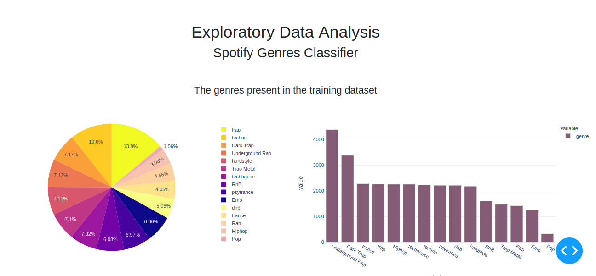

# Sdata Projet

This project is an academic Project in IMT Lille Douai .The aim of the project is to create a classifier of genres based on data collected from Spotify API.
This repo contains the source code of the modeling and the interactive dashboard for the data analysis.

